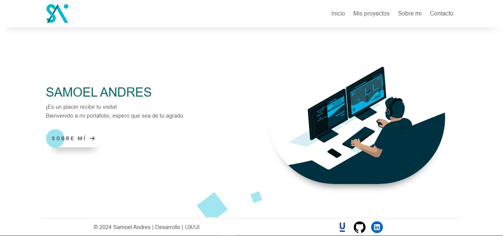

# Mi Portafolio

<br><br><br>

## Descripción

Este repositorio contiene el código de mi sitio web personal. Muestra mis habilidades, proyectos y experiencia como desarrollador.



## Características

- **Diseño responsive**: Funciona a la perfección en todos los dispositivos (escritorio, tableta y móvil).
- **Lista de proyectos**: Destaca proyectos clave con descripciones, tecnologías utilizadas y enlaces en directo.
- **Acerca de mí**: Muestra una breve introducción, habilidades e información de contacto.
- **Interfaz de usuario interactiva**: Incluye animaciones fluidas y un diseño intuitivo.

## Tecnologías utilizadas

- **Frontend**: HTML5, CSS3, JavaScript
- **Estilos**: Bootstrap
- **Backend**: Laravel (PHP)

## Requisitos

- **PHP** 7.4 o superior.
- Un servidor web como **Apache o Nginx**.

## Instalación

Sigue los pasos para ejecutar el proyecto localmente:

1. Clona el repositorio:
   ```bash
   git clone https://github.com/samoel-andres/my-portfolio.git
   ```

2. Navega a la carpeta del proyecto:
   ```bash
   cd my-portfolio
   ```

3. Configura tu servidor web para que apunte al directorio del proyecto, asegurándote de que la configuración del **DocumentRoot** esté correcta (si usas Apache, por ejemplo).

4. Abre el proyecto en tu navegador visitando la URL configurada (por ejemplo `http:/localhost/my-portfolio/`

## Uso

Una vez que el servidor esté en funcionamiento, puedes acceder a las diferentes rutas de la aplicación. El controlador correspondiente se encargará de manejar la solicitud y presentar la vista adecuada. Las rutas son gestionadas por el controlador principal.
